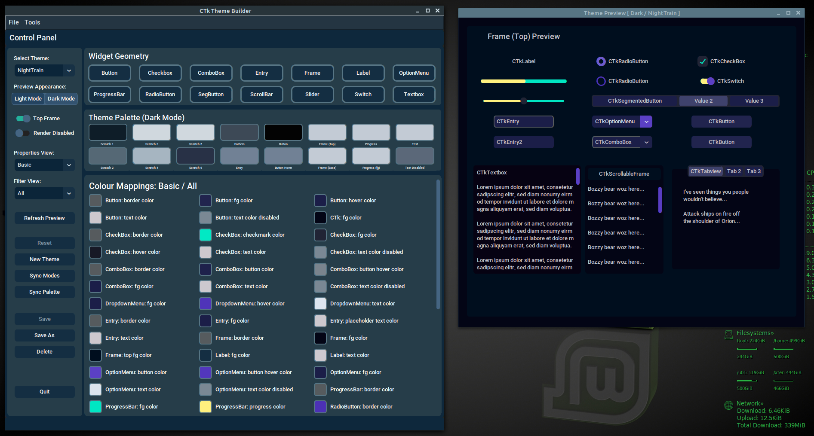

# CTk Theme Builder
Hello and welcome to the CTk Theme Builder repository!

CTk Theme Builder provides a WYSIWYG interface for creating and maintaining [CustomTkinter](https://github.com/TomSchimansky/CustomTkinter) themes.

Installation instructions can be found [here](docs/md/installation.md).

There will be more documentation to follow, please <i>bear</i> with me. In the meantime, there are plenty of tooltips to keep you going.
