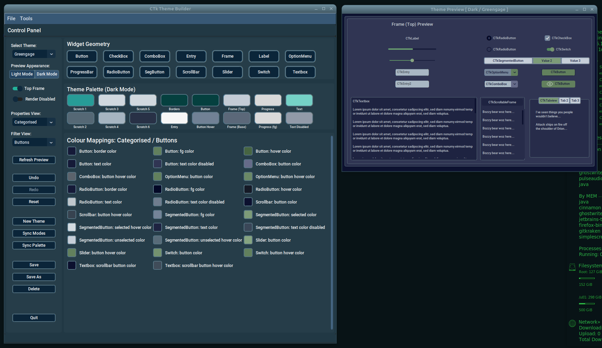

# CTkThemeBuilder
Hello and welcome to the CTk Theme Builder repository!

 <figure>
  
</figure> 

CTk Theme Builder provides a WYSIWYG interface for creating and maintaining [CustomTkinter](https://github.com/TomSchimansky/CustomTkinter) themes.

Jump straight to the deployment instructions by going [here](docs/deployment.md).

The user guide, can be found [here](docs/user_guide.md).
