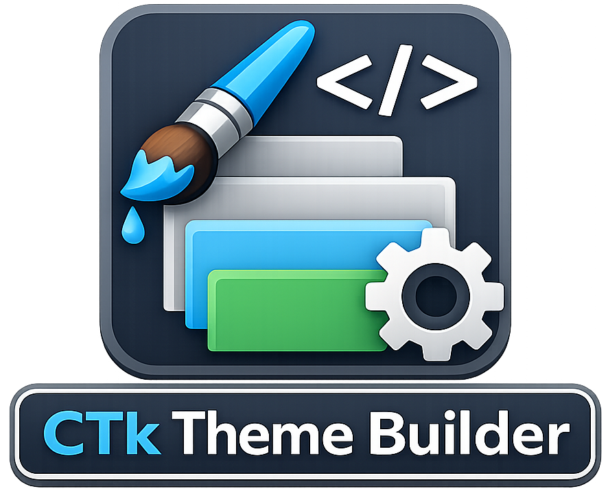

# CTk Theme Builder



CTk Theme Builder is a desktop editor for creating, previewing, and refining themes for [CustomTkinter](https://github.com/TomSchimansky/CustomTkinter) applications.

It provides a live preview workflow for adjusting colours, geometry, palettes, and theme metadata without editing theme JSON files by hand.

## Features

- Visual theme editing with live preview
- Support for light and dark theme variants
- Theme geometry editing for supported widget properties
- Palette management and colour harmonics tools
- Theme merge and import/export support
- Provenance tracking for theme metadata
- Built-in theme and palette assets to get started quickly

## Installation

Recommended installation from PyPI, using a virtual environment:

```bash
python -m venv .venv
source .venv/bin/activate
pip install ctk-theme-builder
```

On Windows PowerShell:

```powershell
python -m venv .venv
.venv\Scripts\Activate.ps1
pip install ctk-theme-builder
```

Alternative install methods for users who already use `uv`:

```bash
uv pip install ctk-theme-builder
uvx --from ctk-theme-builder ctk-theme-builder
```

## Usage

Launch the application:

```bash
ctk-theme-builder
```

Optional command-line arguments:

```bash
ctk-theme-builder --set-appearance Dark
ctk-theme-builder --set-theme /path/to/theme.json
```

To migrate themes and palettes from a legacy installation:

```bash
ctktb-migrate-assets /path/to/old/install
```

## Requirements

- Python 3.10 to 3.13
- A desktop environment capable of running Tk-based GUI applications

## Documentation

- Installation and upgrade notes: [docs/installs-upgrades.md](docs/installs-upgrades.md)
- User guide: [docs/UserGuide-3.3.md](docs/UserGuide-3.3.md)
- Release notes: [release-notes-3.2.4.md](release-notes-3.2.4.md)
- Source code and issue tracker: [GitHub repository](https://github.com/avalon60/ctk_theme_builder)

## Licence

Released under the MIT Licence. See [LICENSE](LICENSE).
