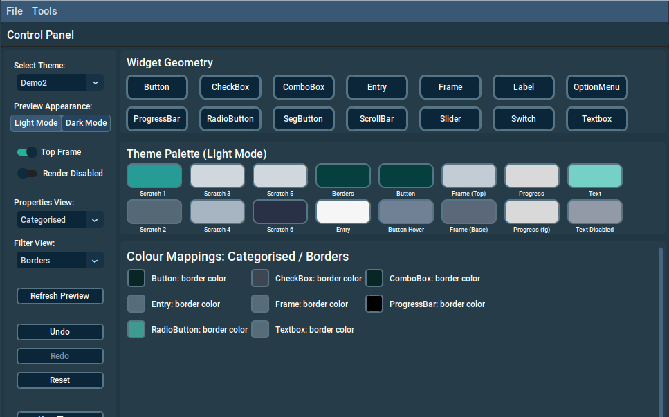

# Introduction

### Acknowledegments
*A thank-you to my ever patient, ever loving, beautiful wife, who has let me hide in my office and beaver away at this project, for many an hour.* 
   
*I would also like to thank my friend and colleague, Jan Bajec, for his graphics contribution.*

### A Bit of History
In case you are wondering, "so where is CTk Theme Builder version 1.0?", well it was never made public. CTk Theme Builder, started with very humble beginnings. In fact it started with a crude CustomTkinter program which was used to display the results of theme file modifications, performed using a Vim editor (yes I also use Vim - sue me ;o). Features were added and added, and well, the project grew legs and became a bit of an obsession. Version 1.0 was based on CustomTkinter 4, which had a radically different JSON format for the theme files. So when Tom decided to release v5 with a drastically different format, I decided to take a break and let things with the new version, bed in. Anyway, although the initial CTk Theme Builder was functional, it was never as polished as I would have liked.  The CustomTkinter v5 JSON format was actually a game changer - much improved and more object oriented, although it did present some non-trivial re-engineering challenges, but finally, here we are.

### Key Features
CTk Theme Builder has been developed and refined, based on experience developing CustomTkinter themes, as well as some input provided by friends and colleagues. 

Key features include:  

* A WYSIWYG Interface - see the effect of your changes as you make them, via a preview panel;
* Ability to flip between Light and Dark theme modes;
* Ability to flip into a render as disabled mode;
* A widget geometry editor, allowing you to set widget borders, corner radius etc;
* A views system, which provides a convenient & flexible way for navigating  widget colour properties;
* The ability to merge themes - merge 2 themes into 1;
* A feature for swapping Light & Dark modes;
* Provenance - authors details, date created, date modified plus other attributes are stored to the, theme and can be viewed via the app.
* Colour palettes, which are associated to a theme, helping you to plan and leverage your colours;
* A Colour Harmonics feature, which allows you to generate complementary colours, based on a number of colour methods. These can be copied to the theme colour palette, at the click of a button.
* Easy colour shade adjustments, via a floating (right-click) menu, available via widget colour property tiles;
* The ability to copy/paste colours between widget colour property tiles;
* A preference option, allowing you to auto-load the last theme you worked on, when you open the Theme Builder application.
* Lots of tooltips to help you on your theme building journey. These can be disabled via the Preferences;
* Widget scaling options, accessible via the Preferences.
* Undo / Redo controls, for undoing & redoing individual changes.

### CustomTkinter Version
Version 3.1 of CTk Theme Builder was designed around CustomeTkinter 5.2.2. Any behaviours / features described herein, are based upon this version. When you install CTk Theme Builder, it will install library modules into a virtual environment. Included in this virtual environment, will be CustomTkinter 5.2.2. If you upgrade, or downgrade the installed CustomTkinter version within its virtual environment, this may have unpredictable results.

## Fundamentals

### Primary Panels
There are two main panels, the *Control Panel* and the *Preview Panel*. There are a sections in the guide, which cover these panels as well as other dialogues.

The job of the *Control Panel* is to present necessary interface controls, giving you the means to create and manage the appearance of your theme. The controls comprise the main control function along the left side of the panel. The main bulk of the *Control Panel* window, is comprised of property tiles used to assign colours to the theme palette and to individual widget properties. There are also a number of buttons near the top, which allow you to select individual widget types, so that you can adjust the theme geometry properties (corner radius, border width etc.) of the CustomTkinter widgets. 

The *Preview Panel* appears when a theme has been opened and then remains for the duration of the session. Once opened the *Preview Panel* only closes, when you *Quit* via the *Control Panel*.

### Window Positions
Whenever you drag and release one of the main windows into a new location of your display, CTk Theme Builder keeps track of where you place it. So for example, you may choose to have the *Preview Panel* on the left and the *Control Panel* to the right of it. When you quit the application, it saves the settings, and will subsequently restore the window positions when CTk Theme Builder is next started.

### Copy / Paste Operations
There are various sets of colour tiles, presented by the application. These appear in the control panel as well as the Colour Harmonics Panel (you will learn about these later). In most cases, you can copy and paste hex colour codes (format: #RRGGBB), between these. You can also copy colour codes based on searches from the Web, and / or by using colour samplers. As long as you have a valid hex colour code in your clipboard, you can paste it onto a colour tile.

Copy and Paste functions are accessible via a floating menu, which activates when you position your mouse pointer over a tile, and right-click.

### Colour Picker
Right clicking a colour tile, on any update-able tile, will cause a floating menu to appear. Included on the menu is a *Colour Picker* option. When selected a pop-up will appear, allowing you to choose, or paste a colour.

When the colour picker appears, the initial colour will automatically reflect the colour of the tile, from which it was invoked.

The appearance of the Colour Picker will vary, depending on your operating system. On Linux you will see the Tkinter, built-in colour picker, whereas for example on Windows, you will see a Windows native colour picker. 
 

### Appearance Modes
If you are sufficiently acquainted with CustomTkinter, you will be aware that the themes designed for CustomTkinter allow you to switch between a Dark Mode and a Light Mode.

When working your themes, you work / see, one appearance mode of a theme, at any given time, but can switch back and forth between the two whenever you wish.

### Concurrency
CTk Theme Builder's control panel, communicates with the preview panel, via sockets. By default the listener port used by the preview panel, is 5051. You can only run one instance of CTk Theme Builder at a time using a given socket.  If you attempt to run two instances of CTk Theme Builder on the same computer, with the same socket, you will see a timeout message similar to the one seen here:

You can however change the *Listener Port* in the *Preferences* dialogue. This will then allow you to run another instance of CTk Theme Builder, from a different install location, if required. It also offers you some latitude, in the event that the default port is in use, by another program.

# Menus
As you have possibly noticed, when you launch CTk Theme Builder, the control panel has a menu toolbar. This includes a *File* menu as well as a *Tools* menu, as we see here:

Note that these are presented differently on MacOS.

The options of the File menu, bear a close correspondence to the buttons displayed on the control panel, whereas the Tools options are only available via the menu toolbar.

## The File Menu

When you first start CTk Theme Builder, if you don't have a theme selected, you will find that most of the *File* menu options are disabled. They only become enabled when you start working on a theme.

#### Options
Some options on the *File* menu, have corresponding buttons in the left hand region of the control panel. Please refer to the section on the Control Panel to read about their respective function. 

Options which are not included as *Control Panel* buttons, are described here.

#### Flip Modes
The Flip Modes function effects changes upon the currently selected theme's appearance mode. 
This option allows you to swap around the Light mode colour properties, with those defined for the Dark mode.

#### Provenance
The _File_ menu also includes a _Provenance_ option, which provides details of who created the theme, as well as other details, as we can see here:

#### Launch QA App
This option becomes available when you open a theme. 

The Quality Assurance (QA) application, is an enhanced version of the complex_example.py, which Tom Schimansky included as a sample application, with CustomTkinter 5.1.

It is strongly recommended that you take advantage of this feature. It serves as an alternate rendering of your theme. When you think your theme is complete, or almost complete, launching this app provides the nearest thing to an acid test. 

A key distinction here, is that the QA app does not employ any frames embedded within another frame, which is in contrast to the CTk Theme Builder preview panel. Because of this, you don't get to see the CTkFrame `top_fg_color` effects. So by using both the QA app and the preview panel, you get to see a more varied implementation of the theme, and therefore more opportunity to spot any issues.

When you select this menu option, the QA app is launched, and renders based upon the current state of your work in progress theme. Make a change and re-launch the QA app and you can see the effect. You don't need to perform a Save operation of your theme, to review the effect of your changes. Here is an example screen shot:

The default UI Scaling for the QA application, is a setting of 80%. The scale can be modified within the Preferences dialogue. This is accessible via the *Control Panel, Tools* menu.

The QA application, once launched is semi-autonomous; You can close it via the _Close_ button on the bottom right of the QA application. You can also open more than one instance of the QA application, allowing you to compare interim changes to the theme. From version 2.3 of the theme builder onward, all instances of the QA application are closed automatically, when you exit the theme builder via the _Quit_ button on the Control Panel.

**The _Provenance_ option is only available for themes created using CTk Theme Builder. If you need to access it for a file of different origin, you need to do a _Save As_, and edit the theme as per the new theme name.**

#### Export Theme
When selected, causes an Export theme dialogue to appear. When selecting a theme from the option (drop-down) menu, a navigation dialogue is presented and you can choose a directory to export the theme to. If you export another theme, within the same dialogue instance, the last location you exported to is remembered and the dialogue will start from there.

Once you have selected the export location, click the _Export_ button to proceed with the export.

The default export location whenever the dialogue is launched, will be your *Downloads* directory, should one exist. Failing this it will be your home directory.

#### Import Theme
When selected, causes an Import theme dialogue to appear. Click on the Folder icon/button, to navigate to an select a theme JSON file for import. Once selected the file will be imported to your themes location.

Note if a theme with the same name exists within your themes location, you will be asked to confirm that you want to overwrite it.

#### Import Theme

## Tools Menu

The *Tools* menu provides access to:

1. User Preferences
2. Colour Harmonics dialogue
3. Merge Themes
4. About (CTk Theme Builder)

The Colour Harmonics option is only enabled, when you start working on a theme.

Each of these options, are covered in their own dedicated section of the guide. 

### User Preferences
The Preferences dialogue is accessed via the *Tools->Preferences* menu option.
The preferences screen will appear something like this:

As of version 3.1 the User Preferences dialogue is split out into the following regions:

+ Provenance
+ Appearance
+ Colour Controls
+ Behaviour
+ Comms
+ User Themes
+ Logging

These are covered in the following sub-sections.

For new installations, the Preferences dialogue should be the first port of call, if only to ensure that you have updated the Author (see below), to ensure you are adequately credited for your good work.

#### Provenance
##### Author
For a new installation the Author defaults to the user name that you are logged in as. You can simply over-type this, to whatever suits. 

The author, along with some other theme specifics, is automatically embedded into the JSON, of any theme files that you create. When you open a theme created (or produced using *Save As*) by CTk Theme Builder, the Author's details can be viewed via the *Files > Provenance* menu option.

#### Appearance
##### Control Panel Theme
For a new installation the application defaults to using the GreyGhost theme. If you are not comfortable with this theme, there are a number to choose from, although it may be a good idea to choose one which is not to obtrusive, such as Oceanix.

Please be aware that after saving you preferences, the a new theme choice will not come into effect, until you re-launch CTk Theme Builder. 

##### Appearance Mode

This option allows you to choose the Appearance Mode. Changing this effects a change to the Control Panel's  appearance mode. Currently, *Light* and *Dark* modes are supported.
Changing this has an instant effect, once the _Save_ button is pressed. Be aware that the default theme, GreyGhost, will not appear to change when you switch appearance modes - this is by design.

#### Colour Controls
##### Adjust Shade Step
This setting allows you to tune the shade step options, which are available when you right click a colour tile. The larger the value chosen, the bigger the colour shade step applied, when the *Lighten Shade/Darken Shade*options are selected.

*Shade Steps* influence the behaviour demonstrated in the above image, which is taken from the *Colour Mappings* region of the *Control Panel*. This is covered later, in the *Control Panel* section. 

##### Harmony Shade Step
This setting allows you to tune the behaviour of the colours generated in the Colour Harmonics dialogue. The larger the selected value, the bigger the difference in consecutive shades generated to the right side of the dialogue.

The *Harmonics Panel* is covered a little later.

#### Behaviour
##### Tooltips
By default tooltips are enabled. The application is quite generous with tooltips and you might find these useful. However, if you wish you can disable these via this option.

##### Confirm cascade
The Confirm cascade switch, when enabled, causes a pop-up dialogue, whenever a Cascade colours option is selected from the floating menu of one of the  Theme Palette tiles (by right clicking the tile). 

The dialogue presents a list of the widget properties, which will be updated to the tile colour, and asks whether you wish to proceed or not. 

If the switch is disabled, then the colour cascade function proceeds without intervention. Bare in mind that with great power, comes great responsibility.

##### Theme Palette Labels
If you wish to save some real-estate, you can disable colour palette labels.

By default these are enabled, and you should see something similar to what is shown here:  
  

However, be aware that the labels can be useful in conjunction with the colour cascade functionality (accessed via a right click of a palette tile).

##### Load Last Theme
If enabled, this causes the last theme you were working on to be automatically opened, when you next start CTk Theme Builder.

Linux users should be aware that by default the clipboard contents are emptied if the application is closed. However, there are tools such as *Clipboard Manager*, which can prevent this.

##### Single Click Paste
This option is disabled by default. When set to enabled, it activates the single left mouse click to be used to paste colours into a property colour, or palette tile. Be aware that if you enable this, it's all too easy to get mouse-click happy and perform an unintentional paste. If you want to play it safe, stick to using the right click -> context menu to perform a paste operation.

Changes to this preference, only take effect, when you restart the theme builder application.

#### Comms
##### Listener Port
This drop-down, allows you to choose which networking port, the application should use, to communicate instructions, between the Control Panel and the Preview Panel. 

If you are wanting to run two instances (separate install locations) of CTk Theme Builder, at the same time, they cannot run on the same port number.

#### User Themes
##### Themes Location
The default folder for storing your themes, is the ctk\_theme\_builder/user_themes folder. However you can elect to change this by clicking the Themes Folder icon. This will allow you to navigate to, and select an alternative location.

NOTE: If you change the Themes Location at any time, you will need to manually copy (or cut) and paste your themes from the old location, to the new location, as required.

#### Logging
##### Logfile  
A runtime log is written to the ctk\_theme\_builder/log directory.

##### Logging Level
This effects the level of logging detail written, whilst running the CTk Theme Builder app. This is based on a choice of a number of different levels. Selecting a log level further down the drop-down list, causes less log detail to be written. To assist in trouble shooting a problem, you should temporarily set this to *Debug* or *Trace*. 

Generally you should  have this set to *Info*, or one of the choices further down the list. It is advisable to **not** set the logging level selection, to *Debug* or *Trace*. The log file size can grow rapidly, if you set the logging level to either of these, and in addition performance will be negatively impacted.

#### Log to Stderr
If enabled, then log entries are duplexed to the terminal. Note that this assumes that you are running from a command window.

#### Clear Log
The Clear Log button, will ask for confirmation, before truncating the runtime log. 

#### Control Panel Scaling
Here you can adjust the Widget Scaling of the _Control Panel_. This has an immediate effect, once you hit _Save_. 

Note that may wish to resize the _Control Panel_ window, when the change is made. Once resized, CTk Theme Builder will remember the sizing, and display position, when you next start the app. 

#### Preview Panel Scaling
Here you can adjust the Widget Scaling of the Preview Panel. This has an immediate effect, once you hit _Save_. 

Note that you may wish to resize the _Preview Panel_ window, when the change is made. Once resized, CTk Theme Builder will remember the sizing, and display position, when you next start the app. 

#### QA App Scaling
Here you can adjust the Widget Scaling of the QA (Quality Assurance) application. Unlike the previous two options, this does not have an immediate effect. This scaling is only actioned when you launch the quality assurance application.

Note that you may wish to resize the _QA App_ window, when the change is made. Once resized, CTk Theme Builder will remember the sizing, and display position, when you next start the app. 

### Colour Harmonics

The *Colour Harmonics* panel, is accessed via the *Tools* menu, and only becomes available when you open a theme. 

The idea behind it, is that you can generate colours, around which you can base a new theme.

Amongst other functions, right clicking the *Keystone Colour* tile, presents a *Paste* option, allowing you to seed a hex colour code, which is then used to generate complementary colours. The core generated colours are rendered below the Keystone Colour* on the left. 

The tiles to the right are produced by taking the core colours, and copying them to the first row. Theses are then used to produce shade variants, with each successive row being darkened slightly, as you scan down from the top row of colours, to the bottom. 

You can of course, copy one of the generated darker shades and paste it to the *Keystone Colour*, causing it to generate another set of shade variants. 

**The _Colour Harmonics_ option is only available for themes created using CTk Theme Builder. If you need to access it for a file of different origin, you need to do a _Save As_, and edit the theme as per the new theme name.**

#### Method Options

The drop-down menu, below the *Keystone Colour* tile, allows you the choice of a number of harmony methods:

* Analogous (2)
* Complementary (1)
* Split-complementary (2)
* Triadic (2)
* Tetradic (3)

The numbers in parentheses, indicate the number of generated complementary colours, associated with the method chosen.

You can read more about the methods [here](https://www.oberlo.com/blog/color-combinations-cheat-sheet)

#### Copy to Palette

When pressed, the *Copy to Palette* button, causes the *Keystone Colour*, and the generated colours, immediately below it, to be copied to the *Scratch* tiles on the theme's Theme Palette display. 

#### Tag Keystone
The *Tag Keystone* button, causes the Keystone colour and the chosen harmony method to be tagged to your theme. If you subsequently open the *Colour Harmonics* panel, for a given theme, the colours will be restored to the same state, as per when they were tagged.  

### Merge Themes
The *Merge Themes* function allows you to create a new theme based upon two existing themes. It allows to to choose an appearance mode from each of the two selected themes, and combine them into a new theme. The dialogue looks like this:  

As you can see, you can select the appearance mode required from each of your selected themes.
 
 The "_Map primary mode to_", allows you to choose which appearance mode of the new theme, the selected primary theme's mode, should be mapped to. The secondary theme adopts the complementary mode to this selection. For example, if you map the primary theme's selections to the "Light" mode of the new theme, the secondary theme selections will be mapped to the "Dark" mode.

The new theme adopts all non-color properties from the primary theme selection.

### The About CTk Theme Builder Dialogue

About the About dialogue...

This is accessible, via the Tools menu.  

Aside from a picture of a cute tekno-colour bear, the About dialogue is useful for confirming the versions of CTk Theme Builder & CustomTkinter you are working with. 

If you are creating an issue on GitHub, you should quote the reported versions on the About dialogue.

# Control Panel

Here we see the Control Panel. This is where the real work goes on. 

The Main Controls are accessed via selections and buttons on the left hand side. 

The entries we see under *Widget Geometry* are buttons which allow you to define the respective, non-colour, widget properties.

The area immediately below *widget Geometry* is the *Theme Palette*. This is basically a holding space for your common theme colours.

Finally the Colour Mappings region is where you assign colours to CustomTkinter widget properties.

We will go into detail, on these various regions, in the subsequent sections.

## Main Controls
The first thing to note, is that as with the _File_ menu options, until a theme has been opened, most  of the buttons are disabled. CTk Theme Builder maintains the state of your session, and enables / disables buttons and options accordingly. For example, if you save your theme, the _Save_ button becomes disabled until you modify your theme again.

#### Select Theme
This is a drop-down menu which allows you to select a theme, on which to begin work. The list is generated based upon entries in your user theme location (please see the Preferences section).

Note that a "TestCard" theme is automatically included when you install CTk Theme Builder. This intentionally includes some gaudy colours. If you are new to CustomTkinter theme files, you can use this as a scratch theme, to experiment and discover how widget property changes, effect changes in the widget rendering. Be aware that this theme will be overwritten whenever you perform an upgrade to the app.

#### Preview Appearance
This option allows you to switch the *Preview Panel* (covered in a later section)  between the CustomTkinter *Light* and *Dark* modes. 

This also causes the *Theme Palette* and *Colour Mappings* regions to update, to reflect the widget colour properties configured for the selected mode, for the theme that you are working on.

#### Top Frame
The default position for the *Top Frame* is set to enabled. If enabled this renders the Preview Panel, in such as way as to emulate the rendered widgets inside an embedded (top) frame.

When CustomTkinter renders a top frame, it uses the top\_fg\_color property to determine the frame's foreground colour. This is often a contrasting shade (or colour) to the parent frame's fg\_colour.

It's a good idea to toggle this switch, to ensure that your widgets render well, in both modes.

#### Render Disabled
You should occasionally enable this switch, to see how your widget colours render, when they have been disabled. 

This allows you to ensure that the disabled text colour/shade is discernible against the containing frame's foreground colour.

#### Properties View
The *Properties View* allows you to control the way widgets (or widget groupings) are presented for selection in the *Filter View* drop-down. There is a *Basic*view as well as a *Categorised* view. See the next section, for more details on these.

#### Filter View
Depending on the *Properties View* setting, this drop-down menu allows you to control which properties are listed in the *Colour Mappings* region. 

In *Basic* mode, you can select *All*, to render all property widgets, or you can select an individual widget.

In *Categorised* mode, you can also select *All*, or you can select groups of widgets, based on common attribute. For example, all widgets which allow text entry, or which have scrollable components.

In the above image, we have the *Categorised* view selected and we are filtering on widgets with buttons.

#### Refresh Preview
The *Refresh Preview* button, causes a full reload of the *Preview Panel*. 

This can be useful where you have been changing the state of the widgets in the *Preview Panel*. For example, you may have entered text in a CTkEntry widget and wish to reset its state, such that it re-renders the placeholder text. 

#### Undo / Redo Buttons
These buttons come into play, when you make changes to any of the following:  

- Widget colour property tiles;
- Theme palette colour tiles;
- Any widget geometry changes.

These buttons allow you to undo changes, or redo undone changes one step at a time.

The _Undo_ button and its File menu equivalent, only become enabled, when you make a property change, either by changing a theme palette colour, cascading a colour, from a theme palette tile, or by modifying a widget geometry. The _Redo_ button and its File menu equivalent, only become active, whilst any changes have been undone. If you save the theme or use the _Reset_ button, both _Undo_ and _Redo_ functions will be disabled until further changes are made / undone. 

The _Undo_ and _Redo_ buttons, are not able to roll back or redo changes, when you use the _Sync Modes_ or Sync _Palette buttons_. Neither can you undo actions performed by the *Flip modes*option, available via the *File* menu.

#### Reset Button
This allows you to roll back any changes to your last *Save*. When this is done, the *Preview Panel* is also flashed back to the reset state. 
  
We all make mistakes ;o)

#### New Theme
As this suggests, this allows you to create a brand new theme. When pressed a pop-up dialogue will be displayed, where you can enter the new theme name. When you click *OK* on the New Theme pop-up dialogue, the theme is created and automatically saved. 

If you have been working on another theme, and have unsaved changes, a pop-up dialogue will appear, asking you if you wish to discard your changes.

#### Sync Modes

The Sync Modes button, operates against the **displayed** widget colour properties, which you have currently selected via the *Filter View*, and which are rendered in the *Colour Mappings* region. It's effect is to copy the colour properties to the complementary appearance mode. For example, if you have *Dark Mode* selected, the colour properties will be copied over to the *Light Mode* property counter-parts.

Here we see an example, where we have selected the *Categorised* view and filtered based on widgets with borders:  
  

We can see from the display, that we are working on the *Dark* appearance mode (Dark Mode button is a lighter colour - enabled). The properties showing are all border properties for various widget types. Using the *Sync Modes* here, would result in the border colours on display, being copied to the *Light* mode properties.

This operation does not include the Theme Palette properties.

#### Sync Palette
The Theme Palette holds a separate set of colours, for each of your theme's appearance modes. This function behaves in a similar fashion to the *Sync Modes* button, except that it only effects changes to the *Theme Palette* colours.
 
#### Remaining Buttons
Hopefully you will find the functionality of *Save*, *Save As*, *Delete* and *Quit* somewhat obvious.
Needless to say, if you have any unsaved changes, you will be prompted with a choice of what you wish to do with them.

NOTE: You should use the CTk Theme Builder app to delete unwanted theme files. Deleting them from outside of the application, can lead to orphaned template files, accumulating on disk.

## Widget Geometry
The *Widget Geometry* buttons allow you to target a particular widget type, and adjust its geometry properties (corner radius, border width etc).

To make adjustments, move the sliders and the rendered widget will respond, to provide a mini-preview or the effects of your changes.

Depending on the widget type, different property sliders may appear.

When you *Save* your changes, the preview panel will also update the rendering accordingly, for any matching widget types.

## Theme Palette
Depending on your methodology, you might find the *Theme Palette*, more or less useful. It's an area where you can persist colours, whilst switching between *Filter View* selections, as well as between theme maintenance sessions. 

If you are more methodical, you can use it to plan your colours, in order to strive for better consistency. For example, you may want to use the same colour / shade for most of your widget borders. 
  
  Be aware that the *Colour Harmonics* dialogue has a *copy to Palette** button. When pressed, this will cause the keystone colour, and the generated base colours, to be copied to the first tiles in the Theme Palette (*Scratch1, Scratch2* etc. up to 4 colours in total, depending on the selected harmony method).
  
  If you don't care for the labels which appear below the Theme Palette tiles, they can be switched off, via the Tools > Preferences menu selection.
  
If you right-click a tile in the *Theme Palette* region, you will be presented with a floating  menu. This will provide options for copying, pasting or various options for adjusting the colour of the selected tile. 

An inclusion to the floating menu, is the *Cascade colours* option. Depending on which label you launch the menu from, this option allows you to update the colour to a set of related widget properties. When selected, the default behaviour is for a pop-up dialogue to appear. This will inform you of the various widget properties, which will be subject to the colour assignment, and you will be asked to confirm the change. **The pop-up dialogue can be disabled in the Preferences**.

*Cascade colours* does a lot of heavy lifting, especially in the early stages of theme development. 
As an example, consider the current border settings here:

Note that the border colour in the theme palette is a shade of grey. 

By right clicking the grey tile we see the Cascade colour option:

When selected we are prompted to confirm the action (you can disable the confirmation in _Preferences_, if desired):

Now with the one extra click, we get:

There are cascade options available for all the palette tiles, excepting the Scratch tiles. So for example, the Button tile colour, can be applied to button color, of all widgets with a button.

This last feature is arguably, one of the most powerful features of CTk Theme Builder.

  
## Colour Mappings Region
Here is where you target and manage individual widget colour properties. This region reflects the colour properties of the widgets selected via the *Properties View / Filter View* widgets. Depending on your selection, you will see the widget colour properties, for one, several, or all widget types.

As with the *Theme Palette* tiles, floating menus are available, which allow you to perform operations, as we see here:  
  

#### Shade Adjustment Operations  
The *Lighter Shade/Darker Shade* options, cause incremental adjustments in the shade of the colour, based upon the *Adjust Shade Step* setting, as described under user *Preferences*. 

As you can see there are multiplier options, which allow you to magnify the shade step adjustment. 

The *Lighter Shade/Darker Shade* controls maintain the differential between the RGB channels. This means that as soon as one of the channels touches the min or max allowed values (decimal 0, 255), further adjustments have no effect.

So in the colour example above, we can see that the red channel is maxed out (0xff = 255). This would therefore block any Lighter Shade operations from having any effect. This is done, to prevent the colour from mutating.

#### Copying & Pasting Colours

By using the right mouse click, you can also Copy / Paste colours between tiles. 

# Preview Panel
The *Preview Panel* is launched as soon as a theme is opened. This panel listens for instructions, sent by the *Control Panel*, which tell it what widget   properties, to adjust within the display. It's job, is to make the task of maintaining themes as WYSIWYG as possible.

Whenever you change a widget property, whether that be a colour property or a property relating to the widget's geometry, a message is sent to the *Preview Panel*, instructing it as to what needs updating.

The only way to close the *Preview Panel* is via the *Quit* button, on the *Control Panel* interface. Doing so causes a message to be sent, telling it to close down.

Please refer to *Known Issues & Behaviours* for details on some behaviours of the *Preview Panel*.

The second CTkButton on the preview panel included an icon (eye-con), which shows as black when the appearance mode is set to Light, and white when the the appearance mode is set to Dark. This is to help you design in colours, with icons in mind, ensuring that your colours don't obscure icons.

# Composite Widgets
This section covers widgets which are composites of other widgets. These are worth mentioning to avoid any confusion.

### CTkScrollableFrame

As you can guess by the name, this is an extension of the CTkFrame widget. With the exception of its label_fg_color property, its other property defaults are taken from CTkFrame and CTkScrollbar. Changing the properties of these widgets, will result in changes to the CTkScrollableFrame widget.

### CTkTabview

The CTkTabview widget is a composite of CTkFrame and CTkSegmentedButton. It has no properties of its own in a theme file and so inherits its defaults from these two widget types.

# What's New in CTk Theme Builder 3.1

* Themes can now be Imported / Exported via the *File* menu;
* The preferences screen has been somewhat redesigned;
* Further Improvements to the installation routines;
* Clear (runtime) Log function has been added to the Preferences dialogue;
* A display of the log file size is added to the Preferences dialogue;
* A new theme "Cobalt" has been added.	

These are provided to assist in troubleshooting issues.

See the _Preferences_ section for further details.

### Fixes

* Corrected a Listener timeout pup-up dialogue, which was incorrectly labelled, indicating an incorrect CustomTkinter version had been installed. 

# Known Issues and Behaviours

### CustomtKinter

#### CTkLabel Disabled Text
There is currently no method or theme property, to set disabled text colour for CTkLabel. When disabled, it currently defaults to what is presumably the underlying Tkinter default. An issue has been raised and it looks like a fix will be made available.

#### CTkSlider Configure button_corner_radius
An issue has been raised on the CustomTkinter, GITHub repository where CTkSlider.configure(button_corner_radius=...) is called

*CTk 5.2.0: Exception encountered when configuring CTkSlider, button_corner_radius* #1790. A fix is pending.

For the time being, adjustments to the button corner radius of CTkSlider, have no visual effect inside the geometry pup up. You can however set a value, save it and hit the *Refresh* button, to preview the effect in the *Preview Panel*. 

#### CTkSlider Configure button_length
Adjusting the button length causes:

`raise ValueError(f"{list(kwargs_dict.keys())} are not supported arguments. Look at the documentation for supported arguments.")`
`ValueError: ['button_length'] are not supported arguments. Look at the documentation for supported arguments.`

This has been raised as Issue #1905, [https://github.com/TomSchimansky/CustomTkinter/issues/1905](https://github.com/TomSchimansky/CustomTkinter/issues/1905)
As a partial workaround, CTk Theme Builder, forces a refresh of the Preview Panel, so that the effect of the adjustment can be seen. 
However, you will not see the changes in rel time, within the CTkSlider geometry dialogue.

#### DropdownMenu

In addition, there is the *DropdownMenu* theme property to consider. You can perhaps think of this as a sub-component, used by *CTkComboBox* and *CTkOptionMenu*. The bottom line is that it is not a widget in its own right. This means that to effect any changes made to it in the *Control Panel*, we currently perform a similar action, to that described above - tearing down and rebuilding the widgets in the *Preview Panel*. Unfortunately these widget types don't currently have configurable properties, allowing the drop-down properties to be changed on the fly.

### CTk Theme Builder
#### Copy / Paste
Linux users should be aware that by default the clipboard contents are emptied if the application is closed. However, there are tools, such as *Clipboard Manager*, which can prevent this.

#### Floating Menu Options / Transparent Colour Property
When working in the Colour Mappings region, by using the right mouse click, you can Copy / Paste colours between tiles. However for widget properties which have a value set to "transparent", for example CTkLabel > fg_color, this functionality is disabled. In addition the Colour Picker is also disabled. The reason for this, is that that reversing the addition of a colour, is somewhat problematic. 

