# Introduction

  

*A desktop editor for creating, previewing, and refining CustomTkinter themes.*

## Table of Contents
* [Acknowledgements](#acknowledgements)
* [A Brief History](#a-brief-history)
* [Key Features](#key-features)
* [CustomTkinter Version](#customtkinter-version)
* [Fundamentals](#fundamentals)
* [Menus](#menus)
* [Control Panel](#control-panel)
* [Preview Panel](#preview-panel)
* [Composite Widgets](#composite-widgets)
* [What's New in CTk Theme Builder 3.3](#whats-new-in-ctk-theme-builder-33)
* [Known Issues and Behaviours](#known-issues-and-behaviours)

## Acknowledgements
*A thank-you to my ever patient, ever loving, beautiful wife, who has let me hide in my office and beaver away at this project for many an hour.*

*I would also like to thank my friend and colleague, Jan Bajec, for his graphics contribution.*

## A Brief History
In case you are wondering, "so where is CTk Theme Builder version 1.0?", well it was never made public. CTk Theme Builder started with very humble beginnings. In fact it began as a crude CustomTkinter program used to display the results of theme file modifications performed using a Vim editor. Features were added and added, and the project grew legs.

Version 1.0 was based on CustomTkinter 4, which had a radically different JSON format for theme files. When CustomTkinter 5 arrived with a significantly revised format, CTk Theme Builder had to be re-engineered around it. The CustomTkinter v5 JSON format was a game changer. It was much improved and more object oriented, although it also presented some non-trivial challenges.

## Key Features
CTk Theme Builder has been developed and refined based on practical experience creating CustomTkinter themes, along with helpful feedback from friends and colleagues.

Key features include:

* A WYSIWYG interface, allowing you to see the effect of your changes as you make them via a live preview panel;
* Light and Dark appearance mode editing;
* Ability to preview widgets in a disabled state;
* A widget geometry editor for border widths, corner radii and related non-colour properties;
* A view system, providing convenient ways to navigate widget colour properties;
* Theme merge support;
* Flip Modes support for swapping Light and Dark values;
* Provenance metadata stored with themes created by the builder;
* Theme palettes associated with a theme, helping you to organise and reuse colours;
* A Colour Harmonics feature for generating related colours from a keystone colour;
* Easy shade adjustments via right-click floating menus;
* Clipboard-based copy and paste of hex colours;
* Reusable ghost-swatch drag-and-drop between theme palette tiles and colour mapping tiles;
* Drag-and-drop from the Colour Harmonics dialogue into the Control Panel, and from the Control Panel to the harmonics keystone tile;
* Preferences controlling behaviour, scaling, logging and theme locations;
* Undo and Redo support for colour and palette changes.

## CustomTkinter Version
Version 3.3 of CTk Theme Builder is designed around CustomTkinter 5.2.2. Any behaviours or features described herein are based on that version. When you install CTk Theme Builder, it installs library modules into a virtual environment, including CustomTkinter 5.2.2. If you upgrade or downgrade CustomTkinter independently, results may be unpredictable.

## Fundamentals

### Primary Panels
There are two main panels, the *Control Panel* and the *Preview Panel*. Additional dialogues are launched from these, such as *Preferences*, *Colour Harmonics*, and *Widget Geometry*.

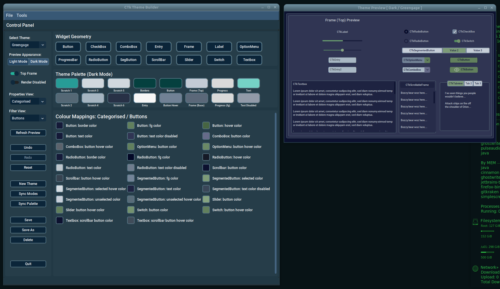

The *Control Panel* presents the controls required to create and manage the appearance of your theme. The left-hand area contains the main operational controls. The main body of the window is used for the *Theme Palette* and *Colour Mappings* regions, where colours are assigned and refined.

The *Preview Panel* appears when a theme is opened and normally remains for the duration of the session. Once opened, it closes only when you *Quit* via the *Control Panel*.

### Window Positions
Whenever you move one of the main windows to a new location on your display, CTk Theme Builder records its position. When the application is started again, the geometry is restored.

### Copy / Paste Operations
There are several sets of colour tiles in the application, including those in the *Control Panel* and the *Colour Harmonics* dialogue. In most cases, you can copy and paste hex colour codes in `#RRGGBB` format between them. You can also copy valid colours from external tools or websites and paste them into the application.

Copy and Paste functions are usually available from a floating right-click menu.

### Drag and Drop Operations
Version 3.3 adds direct drag-and-drop support for colour swatches.

The following drag paths are supported:

* Theme Palette swatch to Theme Palette swatch;
* Theme Palette swatch to Colour Mappings swatch;
* Colour Mappings swatch to Theme Palette swatch;
* Colour Mappings swatch to Colour Mappings swatch;
* Colour Harmonics keystone, harmony, and shade swatches to Theme Palette swatches;
* Colour Harmonics keystone, harmony, and shade swatches to Colour Mappings swatches;
* Theme Palette and Colour Mappings swatches to the Colour Harmonics keystone swatch.

#### Normal Drag
Drag with the left mouse button held down to copy the source colour to the target.

#### Shift + Drag
Hold the `Shift` key while dragging to swap the source and target colours, where both ends are editable. For example, this is useful between palette and mapping swatches. Derived harmony/shade tiles in the *Colour Harmonics* dialogue act as drag sources only and are not intended as editable drop targets.

#### Ghost Swatch
When the drag threshold is exceeded, a small semi-transparent ghost swatch appears and follows the pointer. This provides a clear indication of the colour being dragged.

### Colour Picker
Right clicking an updateable colour tile presents a floating menu which includes a *Colour Picker* option. Selecting this opens a platform-specific colour chooser. The initial colour reflects the colour of the tile from which it was invoked.

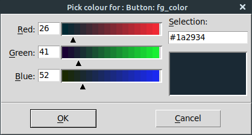

### Appearance Modes
CustomTkinter themes support both Dark Mode and Light Mode. When editing, you work on one appearance mode at a time, but can switch freely between them.

### Concurrency
CTk Theme Builder's Control Panel communicates with the Preview Panel via sockets. By default the Preview Panel listener port is `5051`. If you attempt to run two instances using the same port, you will encounter a timeout.

You can change the *Listener Port* in the *Preferences* dialogue if required.

# Menus
The Control Panel has a menu bar with a *File* menu and a *Tools* menu.

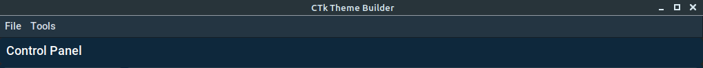

These may be presented differently on MacOS.

## The File Menu

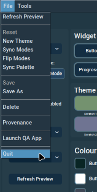

Most *File* menu options are disabled until you open a theme.

### Flip Modes
This swaps the Light and Dark appearance mode colour properties for the current theme.

### Provenance
The *Provenance* option displays metadata about the current theme, such as author and creation details.

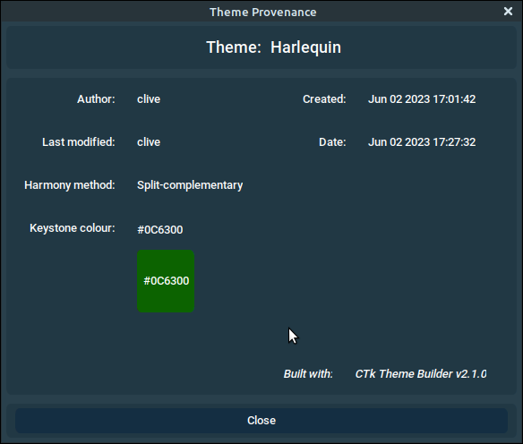

### Launch QA App
This launches the Quality Assurance (QA) application, which provides an alternate rendering of your theme. It is strongly recommended when checking a theme before release.

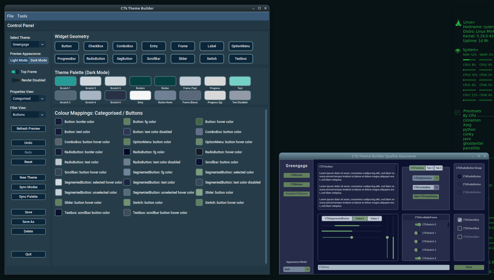

The QA app is semi-autonomous and can be launched repeatedly as required. It is closed automatically when you exit CTk Theme Builder.

## Tools Menu

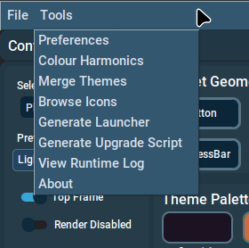

The *Tools* menu provides access to:

1. Preferences
2. Colour Harmonics
3. Merge Themes
4. Browse Icons
5. Generate Launcher
6. Generate Upgrade Script
7. View Runtime Log
8. About

### Browse Icons
This launches the *Icon Browser*, which provides a convenient way to browse available Font Awesome icons.

### Generate Launcher
This creates a launcher for the Python environment from which CTk Theme Builder is currently running.

### Generate Upgrade Script
This creates a small platform-specific upgrade script tied to the current interpreter.

### View Runtime Log
This opens the runtime log viewer so you can inspect recent application activity without locating the log file manually.

### Preferences
The *Preferences* dialogue is accessed via *Tools -> Preferences*.

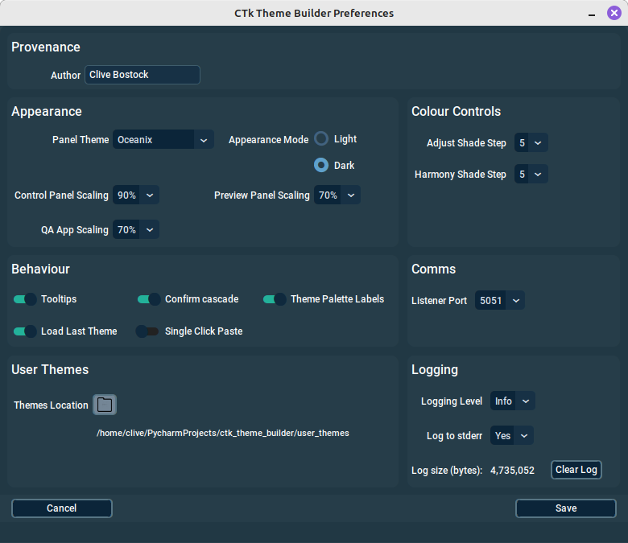

The dialogue is organised into these sections:

* Provenance;
* Appearance;
* Colour Controls;
* Behaviour;
* Comms;
* User Themes;
* Logging.

#### Author
For a new installation the Author defaults to the currently logged-in user name. You can replace this with any name you prefer.

#### Control Panel Theme
For a new installation the application defaults to using the *GreyGhost* theme. You may choose another bundled theme if preferred. After saving your preferences, the new Control Panel theme takes effect when the application is restarted.

#### Appearance Mode
This controls the Control Panel appearance mode. *Light* and *Dark* are supported.

#### Tooltips
Tooltips are enabled by default. They can be disabled here if preferred.

#### Confirm Cascade
When enabled, this causes a confirmation dialogue to appear whenever you choose a *Cascade colour* option from a Theme Palette tile.

#### Theme Palette Labels
If you wish to save some space, palette labels can be disabled.

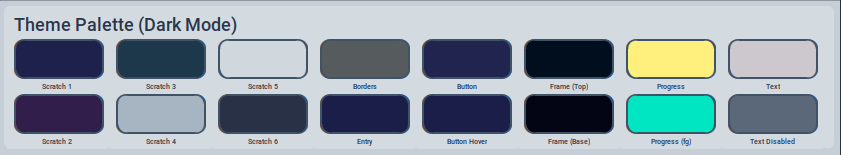

#### Logging
A runtime log is written to `~/CTkThemeBuilder/logs`. The dialogue also allows you to adjust logging verbosity, log-to-stderr behaviour, and to open or clear the log.

#### Load Last Theme
If enabled, the most recently used theme is automatically opened when CTk Theme Builder starts.

#### Single Click Paste
This is disabled by default. When enabled, a single left click is used to paste the clipboard colour into a palette or property swatch.

Be aware that drag-and-drop and single-click paste both use the left mouse button. A simple click still triggers the normal paste behaviour, but once the drag threshold is exceeded, the gesture becomes a drag-and-drop operation instead.

Changes to this preference take effect when you restart the application.

#### Control Panel Scaling
This adjusts the widget scaling of the *Control Panel*.

#### Preview Panel Scaling
This adjusts the widget scaling of the *Preview Panel*.

#### QA App Scaling
This adjusts the widget scaling of the QA application and takes effect when it is launched.

#### Icon Browser Scaling
This adjusts the widget scaling of the Icon Browser.

#### Adjust Shade Step
This setting controls the shade-step operations available from right-click menus on colour swatches.

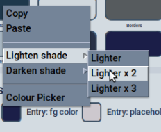

#### Harmony Shade Step
This controls the contrast differential used when generating shades in the *Colour Harmonics* dialogue.

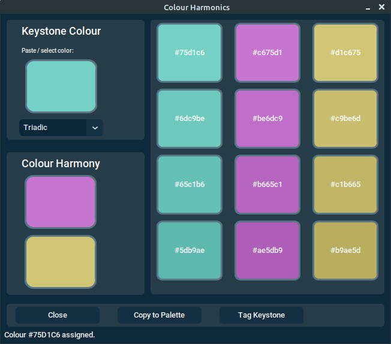

#### Listener Port
This controls the port used by the Preview Panel listener.

#### Themes Location
The default folder for storing user themes is `~/CTkThemeBuilder/themes`. You may choose an alternative location if desired.

### Colour Harmonics
The *Colour Harmonics* dialogue is accessed via the *Tools* menu and is only enabled when you open a theme.

The purpose of the dialogue is to generate related colours around a *Keystone Colour* which can then inform the rest of the theme.

The *Keystone Colour* tile supports:

* Right-click Copy;
* Right-click Paste;
* Right-click Colour Picker;
* Drag-and-drop as a source;
* Drag-and-drop as a target.

This means you can now drag a palette or mapping colour directly onto the *Keystone Colour* tile. When you do this, the harmonics dialogue regenerates its harmony colours and shades immediately using the existing harmony method.

The harmony result tiles and the generated shade tiles support:

* Right-click Copy;
* Drag-and-drop as sources.

These generated tiles are intentionally treated as source-only in the drag-and-drop system. They are intended to feed colours into the rest of the application, rather than being directly edited in place.

#### Method Options
The harmony method drop-down allows you to choose from:

* Analogous (2)
* Complementary (1)
* Split-complementary (2)
* Triadic (2)
* Tetradic (3)

The number in parentheses indicates the number of generated complementary colours.

#### Copy to Palette
The *Copy to Palette* button copies the *Keystone Colour* and the generated harmony colours to the first *Scratch* tiles in the theme palette.

#### Tag Keystone
The *Tag Keystone* button stores the keystone colour and selected harmony method in theme provenance metadata so that they can be restored later.

**The _Colour Harmonics_ option is only available for themes created using CTk Theme Builder. If you need to access it for a theme of different origin, use _Save As_ first so the theme is brought under CTk Theme Builder management.**

### Merge Themes
The *Merge Themes* function allows you to create a new theme by combining the appearance modes of two existing themes.

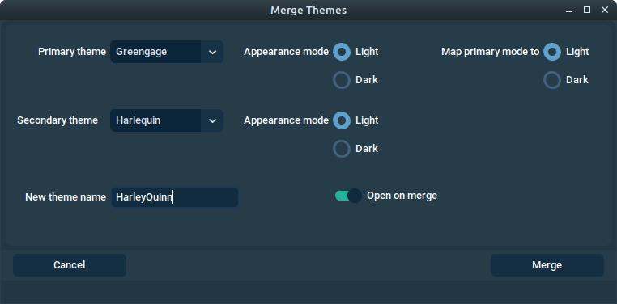

### The About Dialogue
The *About* dialogue is accessible from the *Tools* menu and provides useful information such as the current CTk Theme Builder and CustomTkinter versions.

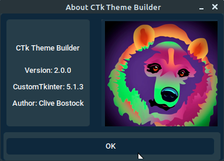

# Control Panel

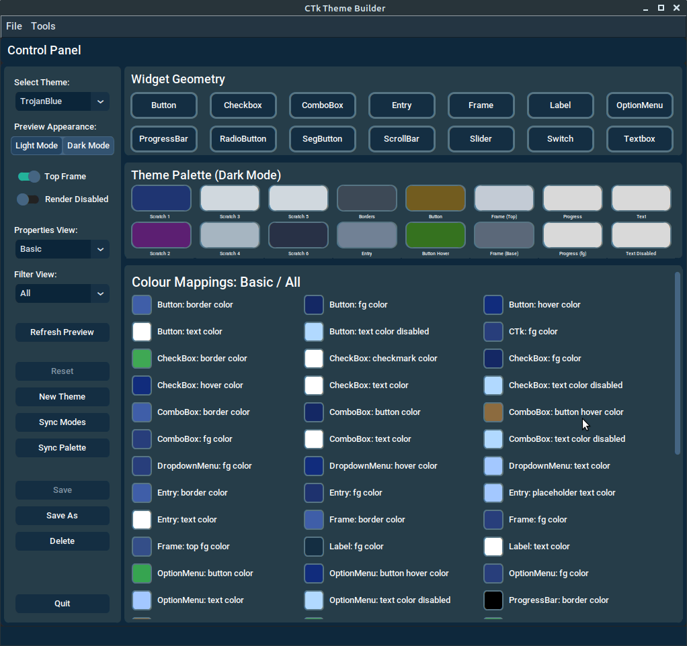

The Control Panel is where the main editing work takes place.

The left side contains the main operational controls.
The area below *Widget Geometry* is the *Theme Palette*.
The *Colour Mappings* region is where you manage individual widget colour properties.

## Main Controls

### Select Theme
Choose the theme you wish to open from the user themes directory.

### Preview Appearance
Switch the Preview Panel between *Light* and *Dark* modes.

### Top Frame
Toggle whether the Preview Panel emulates widgets inside an embedded top frame.

### Render Disabled
Toggle whether widgets in the Preview Panel are rendered in their disabled state. This is useful for checking readability of disabled text.

### Properties View
Choose whether colour properties are presented in a *Basic* or *Categorised* view.

### Filter View
Choose which widget or widget grouping is shown in the *Colour Mappings* region.

### Refresh Preview
Force a rebuild of the Preview Panel.

### Undo / Redo
Undo and redo changes made to:

* Widget colour property tiles;
* Theme palette colour tiles;
* Widget geometry changes.

### Reset
Reset the current theme to the last saved state.

### New Theme
Create a new theme.

### Sync Modes
Copy the currently displayed colour mapping properties to the complementary appearance mode.

### Sync Palette
Copy the current Theme Palette appearance mode colours to the complementary mode.

### Save / Save As / Delete / Quit
These behave as expected. If you have unsaved changes, you will be prompted appropriately.

## Widget Geometry
The *Widget Geometry* buttons allow you to target a particular widget type and adjust non-colour properties such as corner radius and border width.

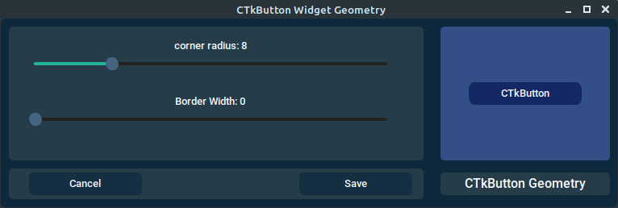

## Theme Palette
The *Theme Palette* is a persistent holding area for commonly used theme colours. It is useful both as a planning surface and as a reusable source of colours while switching views.

The *Colour Harmonics* dialogue can also copy generated colours into the *Scratch* palette slots.

Right clicking a tile in the *Theme Palette* presents a floating menu with operations such as:

* Copy;
* Paste;
* Lighten shade;
* Darken shade;
* Colour Picker;
* Cascade colour, where supported.

### Drag and Drop in the Theme Palette
Theme Palette swatches now support direct drag-and-drop:

* Drag a palette swatch to another palette swatch to copy the colour;
* Hold `Shift` while dragging to swap colours;
* Drag a palette swatch to a Colour Mappings swatch to assign that property colour;
* Drag a palette swatch to the *Keystone Colour* in the Colour Harmonics dialogue to regenerate harmonies from that colour.

This complements, rather than replaces, the existing right-click and clipboard workflows.

### Cascade Colour
The *Cascade colour* option remains one of the most powerful features of the Theme Palette. It allows one palette tile to update a whole family of related widget properties.

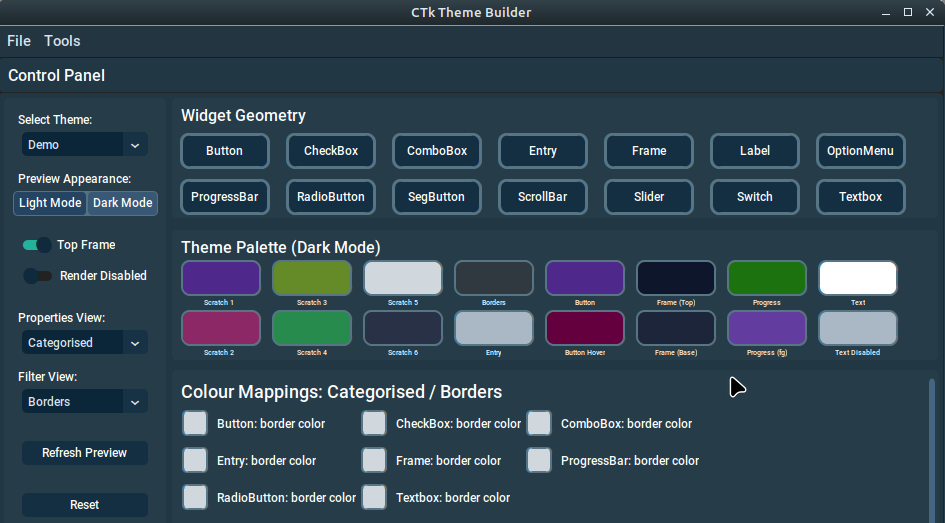
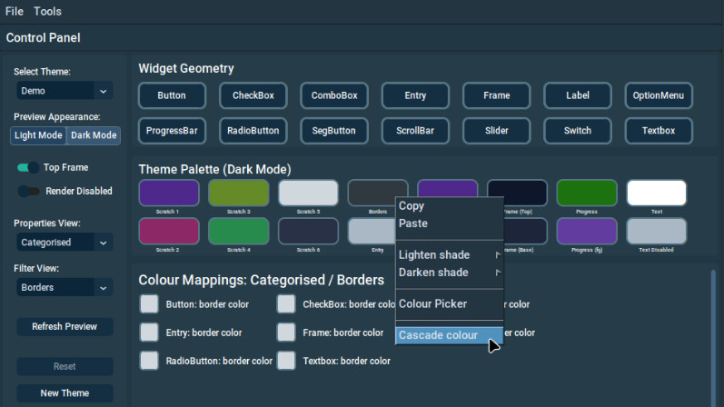
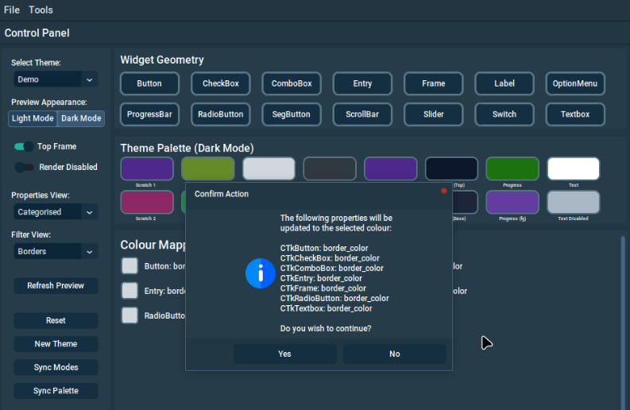
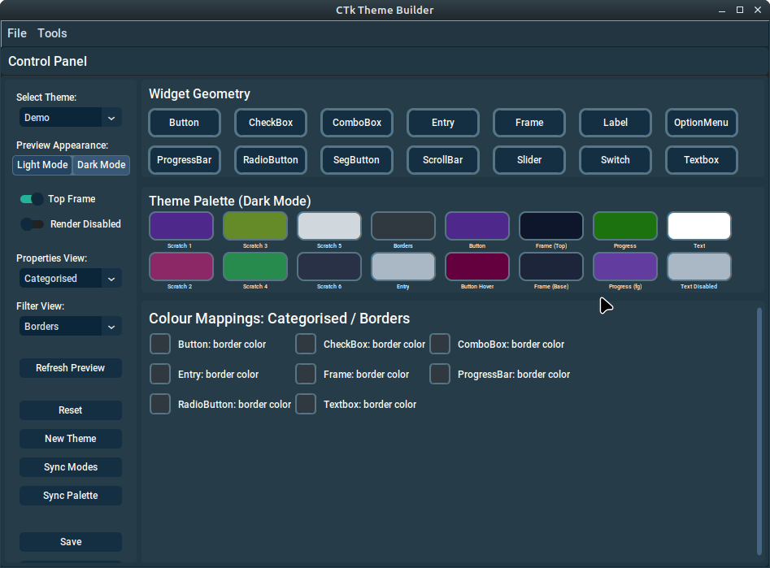

There are cascade options for all palette tiles except the *Scratch* tiles.

## Colour Mappings Region
This is where you manage individual widget colour properties. The region reflects the current *Properties View* and *Filter View* selections.

As with Theme Palette tiles, right clicking a mapping tile provides operations such as:

* Copy;
* Paste;
* Lighter Shade;
* Darker Shade;
* Colour Picker.

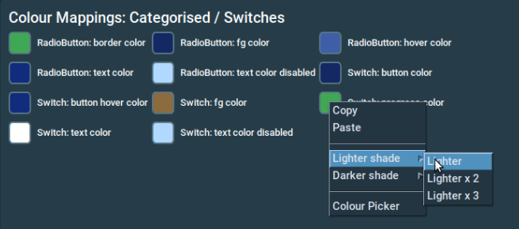

### Shade Adjustment Operations
The *Lighter Shade* and *Darker Shade* options apply incremental shade adjustments based on the configured shade step value.

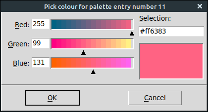

### Copying, Pasting and Dragging
You can still use right-click Copy and Paste between mapping tiles.

Version 3.3 adds direct drag-and-drop for mapping swatches:

* Drag one mapping swatch to another to copy the colour;
* Hold `Shift` while dragging to swap colours;
* Drag a mapping swatch to a Theme Palette swatch to copy or swap colours;
* Drag a mapping swatch to the *Keystone Colour* tile in the *Colour Harmonics* dialogue to regenerate harmonies from that colour.

This drag-and-drop behaviour uses the same underlying update paths as the existing menu and clipboard operations, so live preview updates and dirty-state tracking continue to work in the normal way.

# Preview Panel
The *Preview Panel* is launched as soon as a theme is opened. It listens for instructions from the *Control Panel* and updates widget rendering to make theme editing as WYSIWYG as practical.

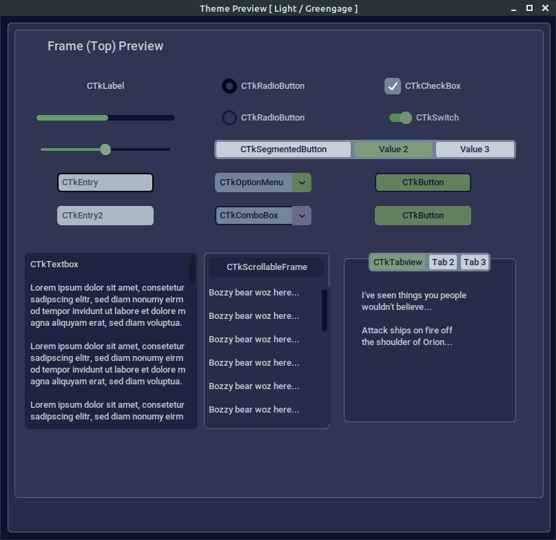

Whenever you change a widget colour property or geometry property, a message is sent to the *Preview Panel* describing what must be updated.

The second CTkButton on the preview panel includes an eye icon which appears black in Light Mode and white in Dark Mode. This is intended to help you judge colours with icons in mind.

# Composite Widgets

### CTkScrollableFrame
This is an extension of `CTkFrame`. With the exception of `label_fg_color`, its properties are inherited from `CTkFrame` and `CTkScrollbar`.

### CTkTabview
This is a composite of `CTkFrame` and `CTkSegmentedButton`. It has no theme properties of its own and inherits from those widgets.

# What's New in CTk Theme Builder 3.3

Ghost-swatch drag-and-drop support for Theme Palette and Colour Mappings swatches;
Shift-drag swap support for editable swatches;
Drag from Colour Harmonics generated swatches into the Control Panel;
Drop from Control Panel swatches onto the Colour Harmonics keystone tile;
Restored and surfaced `text_color_disabled` support across theme files and Control Panel property views;
Updated drag-aware colour handling while preserving the existing live preview update path.

### Fixes

* Restored missing `text_color_disabled` entries in theme JSON files and templates;
* Added Control Panel support for `text_color_disabled` in property views and palette cascade metadata;
* Reduced redundant preview scaling updates to avoid instability during refresh in some CustomTkinter dropdown menu scenarios.

# Known Issues and Behaviours

### CustomTkinter

#### CTkLabel Disabled Text
There is currently no reliable `text_color_disabled` theme property support for `CTkLabel` in CustomTkinter 5.2.2. Disabled label text therefore still follows underlying toolkit behaviour rather than a distinct theme-managed value.

#### CTkSlider Configure button_corner_radius
CustomTkinter 5.2.2 still has an issue when configuring `CTkSlider.button_corner_radius` dynamically. You can save the value and refresh the Preview Panel to confirm the effect.

#### CTkSlider Configure button_length
Adjusting `button_length` still requires Preview Panel refresh assistance because of CustomTkinter limitations.

#### DropdownMenu
`DropdownMenu` remains a sub-component used by `CTkComboBox` and `CTkOptionMenu`. Because it is not a standalone widget in the same sense as the others, some changes still require Preview Panel rebuild behaviour.

### CTk Theme Builder

#### Clipboard Behaviour on Linux
Linux users should be aware that by default clipboard contents may be cleared when the application closes. Tools such as *Clipboard Manager* can help retain them.

#### Transparent Colour Properties
When a widget property is set to `"transparent"`, tile-based colour operations remain limited. For example, `CTkLabel -> fg_color` does not expose the same colour-edit affordances as ordinary hex-based colour properties.

#### Drag and Drop Scope
Within the *Colour Harmonics* dialogue, the *Keystone Colour* tile is a drop target, but generated harmony and shade tiles are intentionally source-only in version 3.3. This keeps derived harmony results consistent and avoids introducing ambiguous editing semantics for generated colours.
