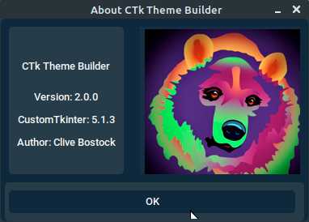

[<- Back](user_guide.md)
# About CTk Theme Builder

> 

> *The ""About" Dialogue*

This is accessible, via the Tools menu.  

Aside from a picture of a cute tekno-colour bear, the About dialogue is useful for confirming the versions of CTk Theme Builder & CustomTkinter you are working with. 

If you are creating an issue on GitHub, you should quote the reported versions on the About dialogue.

[<- Back](user_guide.md)