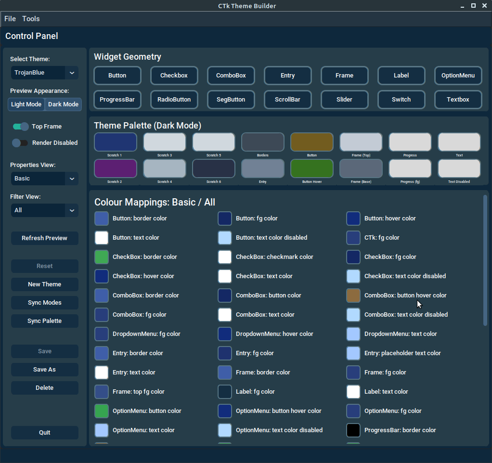
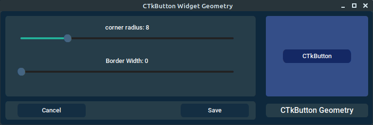
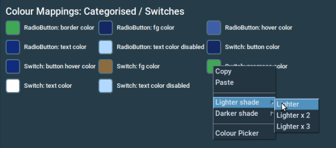

[<- Back to Contents](user_guide.md)
# Control Panel

 <figure>
  
  <figcaption><i>Control Panel display.</i></figcaption>
</figure> 

Here we see the Control Panel. This is where the real work goes on. 

The Main Controls are accessed via selections and buttons on the left hand side. 

The entries we see under *Widget Geometry* are buttons which allow you to define the respective, non-colour, widget properties.

The area immediately below *widget Geometry* is the *Theme Palette*. This is basically a holding space for your common theme colours.

Finally the Colour Mappings region is where you assign colour properties to the CustomTkinter widget properties.

We will go into detail, on these various regions, in the subsequent sections.

## Main Controls
#### Select Theme
This is a drop-down menu which allows you to select a theme, on which to begin work. The list is generated based upon entries in your user theme location (please see the Preferences section).

#### Preview Appearance
This option allows you to switch the *Preview Panel* (covered in a later section)  between the CustomTkinter *Light* and *Dark* modes. 

This also causes the *Theme Palette* and *Colour Mappings* regions to update, to reflect the colours configured for the selected mode.

#### Top Frame
The default position for the *Top Frame* is set to enabled. If enabled this renders the Preview Panel, in such as way as to emulate the rendered widgets inside an embedded (top) frame.

When CustomTkinter renders a top frame, it uses the top\_fg\_color property to determine the frame's foreground colour. This is often a contrasting shade (or colour) to the parent frame's fg\_colour.

It's a good idea to toggle this switch, to make sure that your widgets render well, in both modes.

#### Render Disabled
You should occasionally enable this switch, to see how your widget colours render, when they have been disabled. 

This allows you to ensure that the disabled text colour/shade is discernible against the containing frame's foreground colour.

#### Properties View
The *Properties View* allows you to control the way widgets (or widget groupings) are presented for selection in the *Filter View* drop-down. There is a *Basic*view as well as a *Categorised* view. See the next section, for more details on these.

#### Filter View
Depending on the *Properties View* setting, this drop-down menu allows you to control which properties are listed in the *Colour Mappings* region. 

In *Basic* mode, you can select *All*, to render all property widgets, or you can select an individual widget.

In *Categorised* mode, you can also select *All*, or you can select groups of widgets, based on common attribute. For example, all widgets which allow text entry, or which have scrollable components.

 <figure>
  
  <figcaption><i>Example of a  "Categorised" view display.</i></figcaption>
</figure> 

In the above image, we have the *Categorised* view selected and we are filtering on widgets with buttons.

#### Refresh Preview
The *Refresh Preview* button, causes a full reload of the *Preview Panel*. 

This can be useful where you have been changing the state of the widgets in the *Preview Panel*. For example, you may have entered text in a CTkEntry widget and wish to reset its state, such that it re-renders the placeholder text. 

#### Reset Button
This allows you to roll back any changes to your last *Save*. When this is done, the *Preview Panel* is also flashed back to the reset state. 
  
We all make mistakes ;o)

#### New Theme
As this suggests, this allows you to create a brand new theme. When pressed a pop-up dialogue will be displayed, where you can enter the new theme name.

If you have been working on another theme, and have unsaved changes, a pop-up dialogue will appear, asking you if you wish to discard your changes.

#### Sync Modes

The Sync Modes button, operates against the **displayed** widget colour properties, which you have currently selected via the *Filter View*, and which are rendered in the *Colour Mappings* region. It's effect is to copy the colour properties to the complementary appearance mode. For example, if you have *Dark Mode* selected, the colour properties will be copied over to the *Light Mode* property counter-parts.

This operation does not include the Theme Palette properties.

#### Sync Palette
 This behaves in a similar fashion to the *Sync Modes* button, except that is only effects changes to the *Theme Palette* colours.
 
#### Remaining Buttons
Hopefully you will find the functionality of *Save*, *Save As*, *Delete* and *Quit* somewhat obvious.
Needless to say, if you have any unsaved changes, you will be prompted with a choice of what you wish to do with them.

## Widget Geometry
The *Widget Geometry* buttons allow you to target a particular widget type, and adjust its geometry properties (corner radius, border width etc).

 <figure>
  
  <figcaption><i>Widget Geometry adjustment dialogue.</i></figcaption>
</figure> 

To make adjustments,adjust the sliders and the rendered widget will respond, to provide a mini-preview or the effects of your changes.

Depending on the widget type, different property sliders may appear.

When you *Save* your changes, the preview panel will also update any matching widget types.

## Theme Palette
Depending on your methodology, you might find the *Theme Palette*, more or less useful. It's an area where you can persist colours, whilst switching between *Filter View* selections, as well as between theme maintenance sessions. 

If you are more methodical, you can use it to plan your colours, in order to strive for better consistency. For example, you may want to use the same colour / shade for most of your widget borders. 
  
  Be aware that the *Colour Harmonics* dialogue has a *copy to Palette** button. When pressed, this will cause the keystone colour, and the generated base colours, to be copied to the first tiles in the Theme Palette (*Scratch1, Scratch2* etc. up to 4 colours in total, depending on the selected harmony method).
  
If you right-click a tile in the *Theme Palette* region, you will be presented with a floating  menu. This will provide options for copying, pasting or various options for adjusting the colour of the selected tile. 

If you don't care for the labels which appear below the Theme Palette tiles, they can be switched off, via the Tools > Preferences menu selection.
  
## Colour Mappings Region
Here is where you target and manage individual widget colour properties. This region reflects the colour properties of the widgets selected via the *Properties View / Filter View* widgets. Depending on your selection, you will see the widget colour properties, for one, several, or all widget types.

As with the *Theme Palette* tiles, floating menus are available, which allow you to perform operations, as we see here:  
  
 <figure>
  
  <figcaption><i>Colour Mappings, floating menu.</i></figcaption>
</figure> 
  
The *Lighter Shade/Darker Shade* options, cause incremental adjustments in the shade of the colour, based upon the *Adjust Shade Step*, setting described under user *Preferences*. 

As you can see there are multiplier options, which allow you to magnify the shade step adjustment.

[<- Back to Contents](user_guide.md)