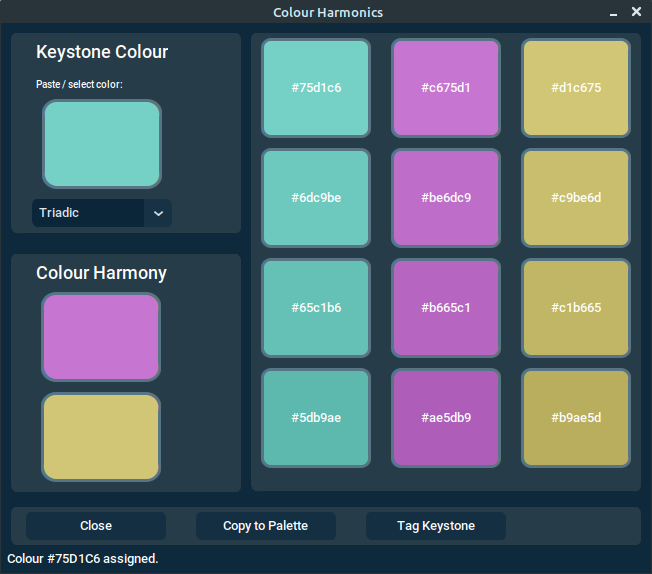

[<- Back to Contents](user_guide.md)
# Colour Harmonics

The *Colour Harmonics* panel, becomes available when you open a theme.

The idea behind it, is that you can generate colours, around which you can base a new theme.

 <figure>
  
  <figcaption><i>The Colour Harmonics panel.  </i></figcaption>
</figure> 

Amongst other functions, right clicking the *Keystone Colour* tile, presents a *Paste* option, allowing you to seed a hex colour code, which is then used to generate complementary colours. The core generated colours are rendered below the Keystone Colour* on the left. 

The tiles to the right are produced by taking the core colours, and copying them to the first row. Theses are then used to produce shade variants, with each successive row being darkened slightly, as you scan down the rows. 

You can of course, copy one of the generated darker shades and paste it to the *Keystone Colour*, causing it to generate another set of shade variants. 

### Method Options

The drop-down menu, below the *Keystone Colour* tile, allows you the choice of a number of harmony methods:

* Analogous (2)
* Complementary (1)
* Split-complementary (2)
* Triadic (2)
* Tetradic (3)

The numbers in parentheses, indicate the number of generated complementary colours, associated with the method chosen.

You can read more about the methods [here](https://www.oberlo.com/blog/color-combinations-cheat-sheet)

### Copy to Palette

When pressed, the *Copy to Palette* button, causes the *Keystone Colour*, and the generated colours, immediately below it, to be copied to the *Scratch* tiles on the themes Theme Palette display. 

### Tag Keystone
The *Tag Keystone* button, causes the Keystone colour and the chosen harmony method to be tagged to your theme. If you subsequently open the *Colour Harmonics* panel, for a given theme, the colours will be restored to the same state, as per when they were tagged.  

[<- Back to Contents](user_guide.md)