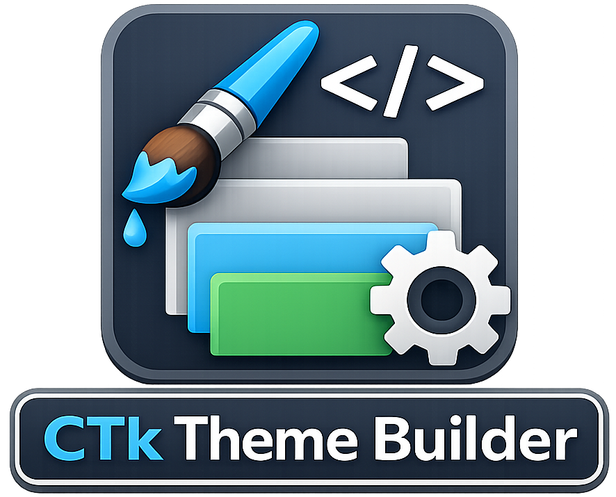

# Installation, Upgrade, And Migration Notes



CTk Theme Builder supports Python 3.10 through Python 3.13.

The main installation guidance now lives in the GitHub-hosted [README](https://github.com/avalon60/ctk_theme_builder/blob/main/README.md).

The wider documentation set, including the user guide and release notes, is also intended to be read from the GitHub repository rather than from the runtime user-data directory.

This note is for the parts that are more operational:

- upgrading an existing installation
- installing from a wheel artefact
- migrating data from an older directory-based install
- troubleshooting PATH and launcher issues

CTk Theme Builder is now distributed as a Python package.
ZIP-file deployments are no longer the supported installation path.
Use PyPI for normal installs, or install from a `.whl` file when working from a release artefact.

## Requirements

- Python 3.10 to 3.13
- a desktop environment capable of running Tk-based GUI applications

For Ubuntu-based distributions, ensure that the `venv` package is installed for the Python version you intend to use. For example:

`apt install python3.12-venv`

### macOS Python and Tk support

The application requires Tk, the graphical toolkit used by Python's `tkinter` module. Installing the PyPI package does not add Tk to an existing Python installation. Before creating a virtual environment, check the exact Python you intend to use:

```bash
python3 --version
python3 -m tkinter
```

The Python version must be 3.10 to 3.13. The second command should open a small Tk test window. An error such as `ModuleNotFoundError: No module named '_tkinter'` means that Python was built without Tk support. A virtual environment made from that Python will have the same problem, even when `pip install ctk-theme-builder` succeeds.

If you use Homebrew, install a supported Python and its matching Tk package. For Python 3.13:

```bash
brew install python-tk@3.13
"$(brew --prefix)/bin/python3.13" -m tkinter
mkdir -p ~/ctk_theme_builder
"$(brew --prefix)/bin/python3.13" -m venv ~/ctk_theme_builder/.venv
source ~/ctk_theme_builder/.venv/bin/activate
python -m pip install ctk-theme-builder
ctk-theme-builder
```

The Homebrew Tk formula installs `python@3.13` as a dependency. Using the full path to `python3.13` avoids accidentally selecting another Python through a shell shim or `PATH`. The `~/ctk_theme_builder` directory holds the virtual environment; the separate `~/CTkThemeBuilder` directory holds the application's themes, palettes, logs and settings.

The macOS installer from python.org is another option because it includes Tk. Check its `python3` with `python3 -m tkinter` before creating the virtual environment. If you already created an environment with a Python that lacks Tk, recreate that environment with the Tk-capable interpreter and then install the package again. Installing `python-tk` afterwards does not change which interpreter an existing virtual environment uses.

### Optional pyenv installation on macOS

[`pyenv`](https://github.com/pyenv/pyenv) lets you keep several Python versions and select one for a particular directory. It is optional; the Homebrew Python route above is simpler if you only need to run CTk Theme Builder. `pyenv local` records a version in that directory's `.python-version` file. It selects the Python used for **new** virtual environments; it does not change the interpreter in an existing one.

If `pyenv` is not already installed, install it with Homebrew and [set up your shell](https://github.com/pyenv/pyenv#set-up-your-shell-environment-for-pyenv). Install Tcl/Tk before building Python so `tkinter` can be built too. If another virtual environment is active, run `deactivate` first. For example, to use the latest available Python 3.13 patch release:

```bash
brew install pyenv tcl-tk@8
pyenv install 3.13
mkdir -p ~/ctk_theme_builder
cd ~/ctk_theme_builder
pyenv local 3.13
python3 --version
python3 -m tkinter
```

The Tk command must open a small test window. If it reports a missing `_tkinter` module, that pyenv Python cannot run CTk Theme Builder. Rebuild it with working Tcl/Tk support or use the Homebrew Python route above. Do not continue with the package install until the test passes.

After closing the test window, create a fresh virtual environment and install the package:

```bash
python3 -m venv .venv-pyenv
source .venv-pyenv/bin/activate
python -m pip install ctk-theme-builder
ctk-theme-builder
```

The `.venv-pyenv` name keeps an earlier environment intact; you can choose another name. For later launches, activate this same environment or run `~/ctk_theme_builder/.venv-pyenv/bin/ctk-theme-builder` directly. If you change the selected pyenv version later, create a new virtual environment and reinstall the package.

## Create And Activate A Virtual Environment

Before installing CTk Theme Builder from PyPI, create and activate a Python virtual environment so the application and its dependencies are isolated from other Python packages on your system. The suggested location is `~/ctk_theme_builder` on Linux and macOS, or `$HOME\ctk_theme_builder` in Windows PowerShell. This directory holds the virtual environment, not a source checkout; cloning the repository is unnecessary for a PyPI install.

Recommended installation from PyPI is via a virtual environment.

On Linux or macOS:

```bash
mkdir -p ~/ctk_theme_builder
cd ~/ctk_theme_builder
python -m venv .venv
source .venv/bin/activate
```

On Windows PowerShell:

```powershell
New-Item -ItemType Directory -Force -Path "$HOME\ctk_theme_builder" | Out-Null
Set-Location "$HOME\ctk_theme_builder"
python -m venv .venv
.venv\Scripts\Activate.ps1
```

## Install From PyPI

Install CTk Theme Builder with:

`python -m pip install ctk-theme-builder`

If your platform prefers `python3`, use:

`python3 -m pip install ctk-theme-builder`

After installation, launch the application with:

`ctk-theme-builder`

Run this command from the same activated virtual environment into which you installed CTk Theme Builder. If the virtual environment is not activated, your shell may not find the `ctk-theme-builder` command, or it may launch a different installed copy.

If you prefer not to activate the virtual environment manually each time, CTk Theme Builder can generate a convenience launcher for the current environment from:

`Tools -> Generate Launcher`

## Upgrade From PyPI

If you have used `Tools -> Generate Upgrade Script`, prefer that route first.

CTk Theme Builder can generate a small platform-specific upgrade script tied to the Python interpreter from which the application is currently running. This is useful when you want a repeatable upgrade command for the correct environment without needing to remember or retype the `pip` command yourself.

Generated upgrade scripts are written into:

- Linux and macOS: `~/CTkThemeBuilder/upgrades`
- Windows: `%USERPROFILE%\CTkThemeBuilder\upgrades`

Platform-specific script names are:

- Linux: `upgrade-ctk-theme-builder.sh`
- macOS: `upgrade-ctk-theme-builder.command`
- Windows: `upgrade-ctk-theme-builder.bat`

When the script is generated, the result dialogue shows the full script path and provides a `Copy Path` button. If you are unsure where your generated script is, open that dialogue again from:

`Tools -> Generate Upgrade Script`

The generated script runs the upgrade by using the same Python interpreter as the current CTk Theme Builder session, so it targets the same environment that is already running the application.

If you have not generated an upgrade script, or if you prefer to upgrade manually, use:

`python -m pip install --upgrade ctk-theme-builder`

If your platform prefers `python3`, use:

`python3 -m pip install --upgrade ctk-theme-builder`

After upgrading, launch the application with:

`ctk-theme-builder`

As with a new installation, run this command from the same activated virtual environment that contains CTk Theme Builder, unless you are using a generated launcher, a generated upgrade script, or another shortcut that already targets that environment.

## Install Or Upgrade From A Wheel

If you have downloaded a wheel artefact, install or upgrade it with:

`python -m pip install --upgrade ./ctk_theme_builder-<version>-py3-none-any.whl`

The `./` prefix is optional, but it makes it explicit that the wheel is a local file.

Replace `<version>` with the wheel version you downloaded.
If you previously used a ZIP download workflow, switch to either the PyPI install commands above or a downloaded wheel file.

After installation, launch the application with:

`ctk-theme-builder`

## User Data Location

CTk Theme Builder keeps mutable user data outside the install location.

The default user data home is:

- Linux and macOS: `~/CTkThemeBuilder`
- Windows: `%USERPROFILE%\CTkThemeBuilder`

This contains the working directories for:

- themes
- palettes
- logs
- temporary files
- application state, including the SQLite database

This means package upgrades do not normally need to rewrite or relocate your working themes and palettes.

## Migrating Themes And Palettes From An Older Install

If you are moving from an older directory-based installation, use:

`ctktb-migrate-assets <old-install-root>`

Example:

`ctktb-migrate-assets /home/clive/utilities/ctk_theme_builder`

The migration command:

- inspects the old install database to find the legacy theme location
- copies only themes that do not already exist in your current user-data theme folder
- copies matching palette files for each newly copied theme
- reports which themes were copied and which were skipped

## PATH

If `ctk-theme-builder` is not found, the Python environment's scripts directory may not be on your `PATH`.

Typical fixes are:

- activate the virtual environment before launching
- install into an environment that already exposes scripts on your `PATH`
- use `uvx --from ctk-theme-builder ctk-theme-builder` if you prefer a tool-managed run path

## Desktop Launchers And Shortcuts

Desktop launchers and shortcuts can be created in a few different ways, depending on how you run CTk Theme Builder.

For an installed package, the preferred target is the installed command:

- Linux desktop launcher: set the command to `ctk-theme-builder`
- Windows shortcut: point to the `ctk-theme-builder` launcher created in the Python environment's `Scripts` directory
- macOS launcher: create a launcher that runs `ctk-theme-builder` from the environment where it was installed

If you install into a virtual environment, the launcher or shortcut must target the command from that same environment.

On Linux, installing from a wheel or via `pip` may also create an application menu entry automatically, depending on the desktop environment and how the Python environment exposes desktop integration.

If you prefer not to deal with virtual-environment activation manually, CTk Theme Builder can also generate a convenience launcher for the current environment from:

`Tools -> Generate Launcher`

This writes a platform-specific launcher into:

- Linux and macOS: `~/CTkThemeBuilder/launchers`
- Windows: `%USERPROFILE%\CTkThemeBuilder\launchers`

The generated launcher uses the interpreter from the currently running CTk Theme Builder session, so it is a practical way to create a clickable shortcut for the exact environment you are using.

On macOS, generating a launcher creates a working copy at `~/CTkThemeBuilder/launchers/.generated/CTk Theme Builder.app`. The hidden `.generated` folder keeps that working copy out of normal app searches. When upgrading from an older version, generation also moves a recognised old app from the visible `launchers` folder into that hidden folder. The dialogue can copy the new app to `~/Applications` and create a Desktop shortcut. Install to Applications first; the Desktop shortcut points to that copy. Running either action again replaces the same destination after confirmation rather than adding another entry. Older versions also copied the whole app to the Desktop. Use **Create Desktop Shortcut** to replace that old copy with a link. The Applications copy has everything it needs to launch the same Python environment.

On Linux, the launcher generation step creates:

- `ctk-theme-builder.sh` as the runner script
- `ctk-theme-builder.desktop` as the desktop-entry file

From the launcher result dialogue you can then:

- copy the launcher path
- install the desktop entry into your applications menu
- create a desktop shortcut

Some Linux desktop environments may still require you to use `Allow Launching` on the desktop shortcut before it behaves like a normal application launcher.

## Wrapper Scripts As A Convenience Option

The repository also still includes these launcher scripts:

- `ctk_theme_builder.sh`
- `ctk_theme_builder.bat`

These are convenience launchers for running CTk Theme Builder directly from a source checkout. They are useful if you:

- keep a local working copy of the project
- want a desktop shortcut that activates the local virtual environment for you
- do not want to activate the virtual environment manually before each run

They are not the primary packaged install path, and they are not installed automatically by `pip`.

In summary:

- installed package: prefer the environment's `ctk-theme-builder` command
- installed package with convenience launching: use `Tools -> Generate Launcher`
- source checkout: the repo-local wrapper scripts can be a practical option
