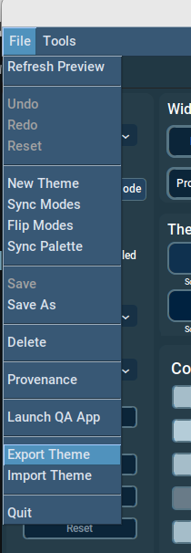

[<- Back](user_guide.md)
# Menus
As you have undoubtedly noticed, when you launch CTk Theme Builder, the control panel has menu a menu toolbar. This includes a *File* menu as well as a *Tools* menu, as we see here:

 <figure>
  
  <figcaption><i>Menu Toolbar.</i>  </figcaption>
</figure> 

Note that these are presented differently on MacOS.

The options of the File menu, bear a close correspondence to the buttons displayed on the control panel, whereas the Tools options are only available via the menu toolbar.

### The File Menu

 <figure>
  
  <figcaption><i>File menu options.</i>  </figcaption>
</figure> 

When you first start CTk Theme Builder, if you don't have a theme selected, you will find that most of the *File* menu options are disabled. They only become enabled when you start working on a theme.

The options on the *File* menu, have corresponding buttons in the left hand region of the control panel. Please refer to the section on the Control Panel to read about their function.

### Tools Menu

 <figure>
  
  <figcaption><i>Tools menu options.  </i></figcaption>
</figure> 

The *Tools* menu provides access to:

1. User [Preferences](preferences.md)
2. [Colour Harmonics](harmonics.md) dialogue
3. [About](about.md) (CTk Theme Builder)

The Colour Harmonics option is only enabled, when you start working on a theme.

Each of these options, are covered in their own dedicated section of the guide. 

[<- Back](user_guide.md)