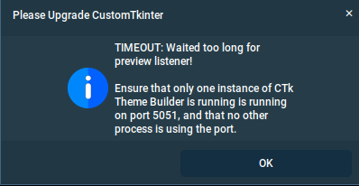

[<- Back to Contents](user_guide.md)
# CTk Theme Builder Overview

### Primary Windows
There are two main windows, the *Control Panel* and the *Preview Panel*. There are a sections in the guide, which cover these panels as well as other dialogues.

 <figure>
  
  <figcaption><i>Control Panel (left) & the Preview Panel (right).</i></figcaption>
</figure> 

The job of the *Control Panel* is to present the controls, giving you the means to create and manage the appearance of your theme. 

The *Preview Panel* appears when a theme has been opened and remains when you switch from one theme to another. Once opened the *Preview Panel* only closes, when you *Quit* via the *Control Panel*.

### Window Positions
Whenever you drag and drop a window, CTk Theme Builder keeps track of where you place it. So for example you may choose to have the *Preview Panel* on the left and the *Control Panel to the right of it*. When you quit the application, it save the settings, and will subsequently restore the window positions when CTk Theme Builder next starts up.

### Copy / Paste
There are various sets of colour tiles, presented by the application. These appear in the control panel as well as the Colour Harmonics Panel (you will learn about this one later). You can copy and paste hex colour codes (#rrggbb), between these. You can even copy hex colour codes based on searches on the Web, and / or by using colour samplers. As long as you have a valid hex colour code in your clipboard, you can paste it onto a colour tile.

### Appearance Modes
If you are sufficiently acquainted with CustomTkinter, you will be aware that the themes designed for CustomTkinter allow you to switch between a Dark Mode and a Light Mode.

When working your themes, you work / see, one appearance mode of a theme, at any given time, but can switch back and forth between the two whenever you wish.

### Concurrency
You can only run once instance of CTk Theme Builder at a time. This is because the *Control Panel* communicates via a fixed socket address (port 5051). If you attempt to run two instances of CTk Theme Builder on the same computer, you will see a timeout message:

 <figure>
  
  <figcaption><i>Listener timeout error message.</i></figcaption>
</figure> 

[<- Back to Contents](user_guide.md)