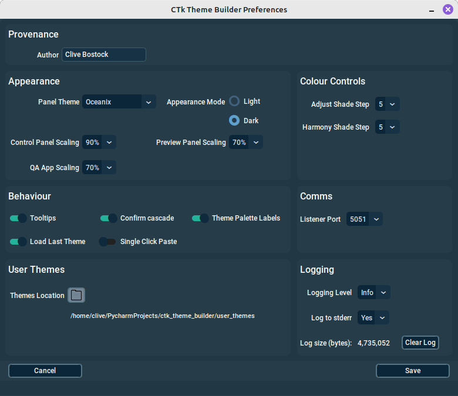
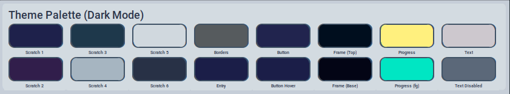
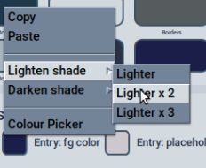
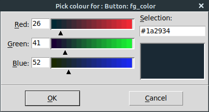
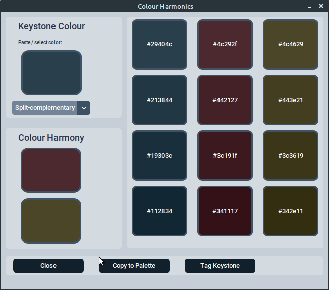

[<- Back to Contents](user_guide.md)
# Preferences
The Preferences dialogue is accessed via the *Tools->Preferences* menu option.
The preferences screen will appear something like this:

 <figure>
  
  <figcaption><i>The user Preferences dialogue.</i>  </figcaption>
</figure> 

For new installations, the Preferences dialogue should be the first Port of call.

### Author
For a new installation the Author defaults to the user id that you are logged in as. You can simply overtype this, to whatever suits. The author is embedded into the JSON, of any theme files that you create.

### Control Panel Theme

For a new installation the Author defaults to the GrayGhost theme. If you are not comfortable with this theme, there are a number to choose from. Please be aware that after saving you preferences, the new theme will not come into effect until you re-launch CTk Theme Builder.

### Appearance Mode

This option allows you to choose the Appearance Mode. This effects the Control Panel's theme appearance. Currently, *Light* and *Dark* modes are supported.
Changing this has an instant effect, once the _Save_ button is pressed. Be aware that the default theme will not appear to change when you switch appearance modes - this is intentional.

### Tooltips
By default tooltips are enabled. The application is quite generous with tooltips and you might find these useful. However, if you wish you can disable these via this option.

### Colour Palette Labels
If you wish to save some real-estate, you can disable colour palette labels.
By default they are enabled, and you should see something similar to what is shown here:  
  
 <figure>
  
  <figcaption><i>The colour Palette region.</i>  </figcaption>
</figure> 

### Load Last Theme
If enabled, this causes the last theme you were working on to be automatically opened, when you next start CTk Theme Builder.

### Copy / Paste
Most colour tiles in the application provide *Copy & Paste* functions (some only provide *Copy*), via a right-click to the tile. This way you can copy a colour from one tile and paste it to another.

Linux users should be aware that by default the clipboard contents are emptied if the application is closed. However, there are tools, such as *Clipboard Manager*, which can prevent this.

### Single Click Paste
This disabled by default. When enabled, it enabled the single left mouse click to be used to paste colours into a property colour, or palette tile. Be aware that if you enable this, it's all too easy to get mouse-click happy and perform an unintentional paste. If you want to play it safe, use the right click -> context menu to perform a paste operation.

### Adjust Shade Step
This setting allows you to tune the shade step options, which are available when you right click a colour tile. The larger the value chosen, the bigger the colour shade step applied, when the *Lighten Shade/Darken Shade*options are selected.

 <figure>
  
  <figcaption><i>Shade step, floating menu options.</i>  </figcaption>
</figure> 

*Shade Steps* influence the behaviour demonstrated in the above image.

### Colour Picker
Right clicking a colour tile, on any updatable tile, will cause a floating menu to appear. Included on the menu is a *Colour Picker* option. When selected a pop-up will appear, allowing you to choose, or paste a colour.

 <figure>
  
  <figcaption><i>Linux Colour Picker.</i>  </figcaption>
</figure> 

When the colour picker appears, the initial colour will automatically reflect the colour of the tile, from which it was invoked.

The appearance of the Colour Picker will vary, depending on your operating system. On Linux you will see the Tkinter, built-in colour picker, whereas for example on Windows, you will see a Windows native colour picker. 
 
### Harmony Shade Step

This setting allows you to tune the behaviour of the colours generated in the Colour Harmonics dialogue. The larger the selected value, the bigger the difference in consecutive shades generated to the right side of the dialogue.

 <figure>
  
  <figcaption><i>The Colour Harmonics Dialogue.</i>  </figcaption>
</figure> 

### Themes Location
The default folder for storing your themes, is the ctk\_theme\_builder/user_themes folder. However you can elect to change this by clicking the Themes Folder icon. This will allow you to navigate to, and select an alternative location.

NOTE: If you change the theme location at any time, you will need manually copy / paste your themes from the old location, as required.

[<- Back to Contents](user_guide.md)