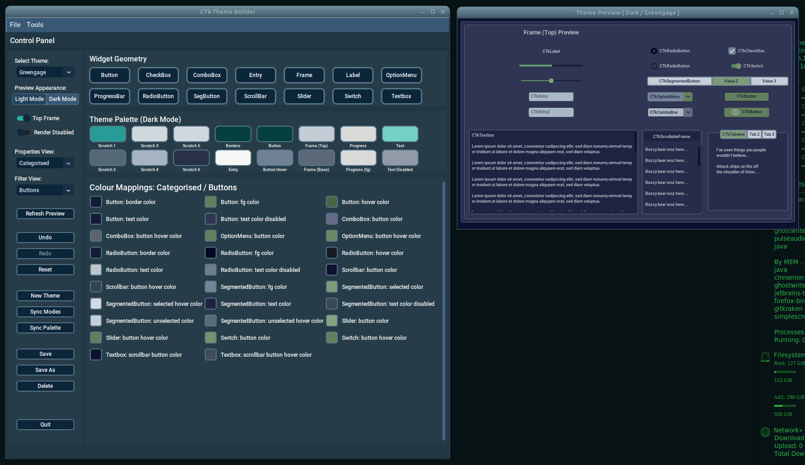

[<- Back](user_guide.md)
# CTk Theme Builder
## Preview Panel
The *Preview Panel* is launched as soon as a theme is opened. This panel listens for instructions, sent by the *Control Panel*, which tell it what widget   properties, to adjust within the display. It's job, is to make the task of maintaining themes as WYSIWYG as possible.

> 

In the above image, we see the Preview Panel, to the right of the Control Panel.

Whenever you change a widget property, whether that be a colour property or a property relating to the widget's geometry, a message is sent to the *Preview Panel*, instructing it as to what needs updating.

The only way to close the *Preview Panel* is via the *Quit* button, on the *Control Panel* interface. Doing so causes a message to be sent, telling it to close down.

Please refer to *Known Issues & Behaviours* for details on some behaviours of the *Preview Panel*.

[<- Back](user_guide.md)